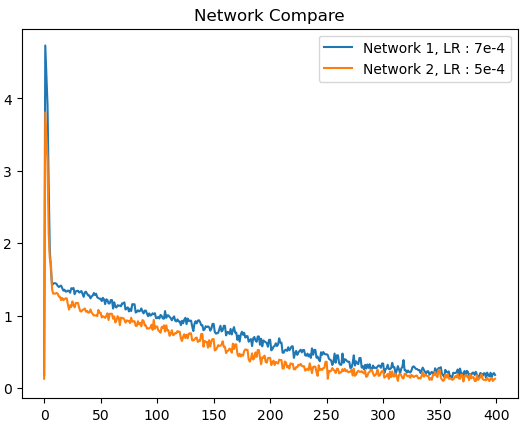
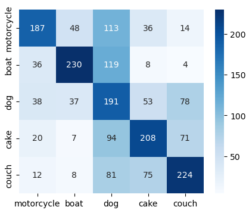
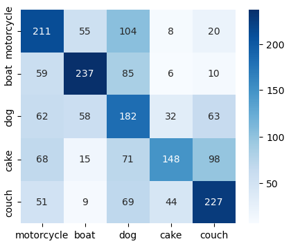
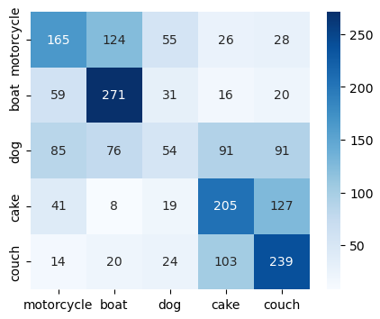

# Skipblocks_COCO
Trying to build a classifier of a 5 class subset of the COCO dataset using a CNN with Skipblocks

## CNN with SkipBlocks

### Loss Graph comparison

### Learning Rate 7e-4 CM

### Learning Rate 5e-4 CM

## CNN without Skipblocks CM

 Both of the two networks perform better than Network 3 without skipblocks which only achieved an accuracy of 46%. The network constructed with SkipBlocks not only is deeper and hence has potential to generalize more it also trains faster compared with Network 3. This is due to the skipblock mitigating the issue of vanishing gradient.
